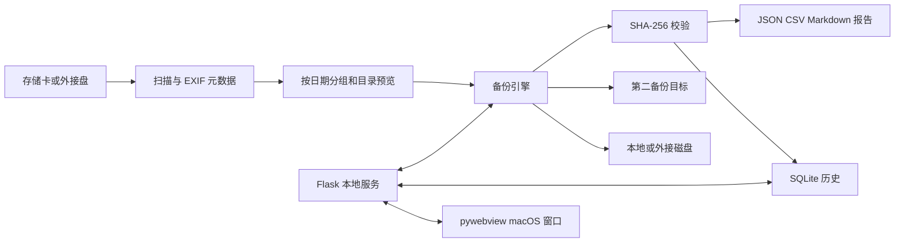

# 技术架构

```mermaid
flowchart LR
  A[存储卡或外接盘] --> B[扫描与 EXIF 元数据]
  B --> C[按日期分组和目录预览]
  C --> D[备份引擎]
  D --> E1[本地或外接磁盘]
  D --> E2[第二备份目标]
  D --> F[SHA-256 校验]
  F --> G[SQLite 历史]
  F --> H[JSON CSV Markdown 报告]
  I[Flask 本地服务] <--> J[pywebview macOS 窗口]
  I <--> G
  I <--> D
```

核心模块：`organizer.py` 扫描与归类，`backup.py` 复制、重试、校验和报告，`db.py` 保存历史与目标结果，`server.py` 提供仅本机使用的界面 API，`desktop/run.py` 提供原生窗口壳。
